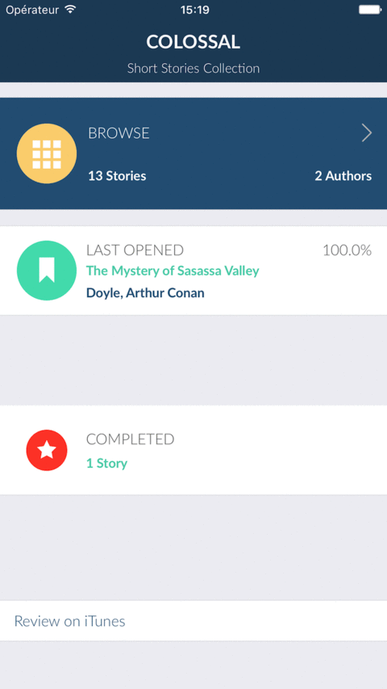

Colossal Collection is a complete Swift 3.0 project, the source code for the latest version of my iOS app [Colossal Short Stories Collection](https://itunes.apple.com/us/app/colossal-short-stories-collection/id341773758?mt=8)

Colossal Short Stories is a premium ebook iPhone & iPad app which bundles over 2400 of the best short stories in the public domain, and was featured on CNET and TUAW several years ago.

## Who is this for?

This repository is public in order to allow interested parties to study and get inspired from it.
The original source code remains proprietary and is **NOT** Open Source. In order to use it in your projects you'll need to acquire a commercial license.

For licensing and for contract work, find my email included inside the source codes or reach me via my website [alexbrie.net](https://alexbrie.net)

## Limitations:
This public repository only hosts 13 short stories from 2 authors (Hans Christian Andersen and Arthur Conan Doyle).

The actual app on iTunes contains over 2400 short stories. If you want to get the full contents, go ahead and download the app [from the AppStore]((https://itunes.apple.com/us/app/colossal-short-stories-collection/id341773758?mt=8)) - it's a good investment.

## Testing and installing

Before testing in the simulator or on device, remember to run pod install to get the required pods.

## Deploying on the AppStore

If you haven't received a written license by email, you are **forbidden** to distribute this project or any project derived from it. Contact me by email for details and an inexpensive license.

## Structure

* App - the contents of the XCode project (source codes, resources)
* main.css, tbr.js - stylesheet and javascript methods used by the reader for formatting and user interaction
* meta.sqlite, stories.sqlite - databases for the actual content.
* Scripts - ruby scripts for creating and populating the sqlite databases from the stories files in html format

## Licensing
* This repository is public and you are free to study and learn from it. 

* The source code is **NOT** Open Source, you are **NOT** allowed to use it (either in full or by copying fragments) in your projects without a written agreement from the author.

* The copyright restriction only applies to the contents of the source files authored by me. I do not claim ownership nor restrict in any way the use of the open source components used in this project.

## 3rd party Licenses
**Libraries**

* SVProgressHUD - https://github.com/SVProgressHUD/SVProgressHUD
* SQLite 
* SQLite.swift - https://github.com/stephencelis/SQLite.swift
* UICircularProgressRing - https://github.com/luispadron/UICircularProgressRing

**Content**

The stories included in this public repository are in the public domain in all countries.

**External Fonts**

* [Lato](http://www.latofonts.com/lato-free-fonts/) - [SIL Open Font License 1.1](http://scripts.sil.org/cms/scripts/page.php?site_id=nrsi&id=OFL)

* [Droid Sans](https://fonts.google.com/specimen/Droid+Sans) - [Apache License, Version 2.0](http://www.apache.org/licenses/LICENSE-2.0)
